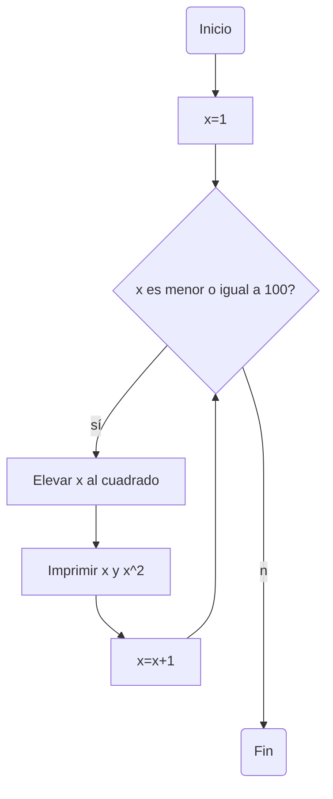
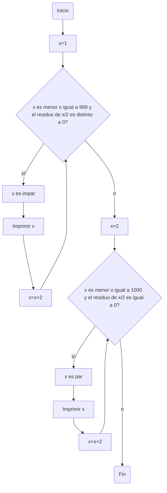
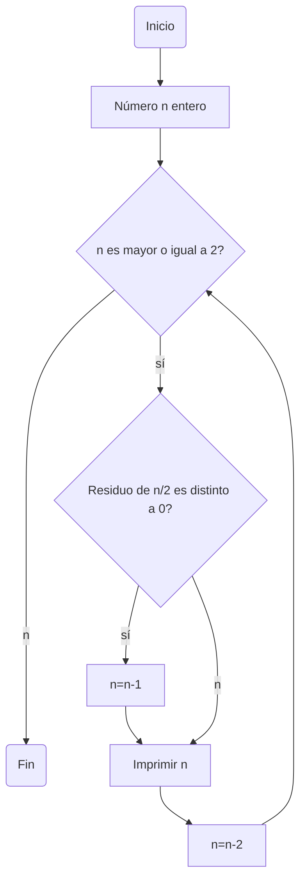

# Reto 7: bucles
**Instrucciones**

Desarrolle de manera individual la mayoría de ejercicios en clase. Para cada punto cree un programa individual asimismo cree un notebook con la solución a todos los problemas. Al finalizar suba todo a un repo y subalo al canal reto_7 en slack, los tres primeros puntos deben incluir diagrama de flujo.

## Punto uno
Imprimir un listado con los números del 1 al 100 cada uno con su respectivo cuadrado.

**Diagrama de flujo**



**Código**

```

x:int#Se declara la variable x, especificando que es de tipo int (dado a que el programa funciona con números enteros)
x=1#Se inicializa a x en 1, ya que el listado debe empezar con este número

while x<=100:#Se ejecuta el bloque mientras x sea menor o igual a 100 (dado a que el listado debe llegar hasta 100)
    cuadrado=x**2#Se halla x elevado a la dos
    print(x, cuadrado, sep=", ")#Se imprimen los valores de x y de x al cuadrado, usando el parámetro separador
    x+=1#x se incrementa una unidad para reiniciar el ciclo hasta que no se cumpla la condición de x<=100

```

## Punto dos
Imprimir un listado con los números impares desde 1 hasta 999 y seguidamente otro listado con los números pares desde 2 hasta 1000.

**Diagrama de flujo**



**Código**

```
x:int#Se declara la variable x, especificando que es de tipo int (dado a que el programa funciona con números enteros)
x=1#Se inicializa a x en 1, ya que el listado de los números impares debe empezar con este número

while x<=999 and x%2!=0:#Se ejecuta el bloque mientras x sea menor o igual a 999 (el listado de impares debe llegar hasta 999) y mientras el residuo de x dividido 2 sea diferente a 0 (propiedad de números impares)
    print(x)#Se imprime el valor del número impar x
    x+=2#x se incrementa dos unidades (sumando 2 a un número impar se obtiene otro número impar) para reiniciar el ciclo hasta que x>999

#Cuando la condición del ciclo while se deja de cumplir, este se termina y se empieza a ejecutar el siguiente bloque de instrucciones

x=2#Se inicializa a x en 2, ya que el listado de los números pares debe empezar con este número

while x<=1000 and x%2==0:#Se ejecuta el bloque mientras x sea menor o igual a 1000 (el listado de impares debe llegar hasta 1000) y mientras el residuo de x dividido 2 sea igual a 0 (propiedad de números pares)
    print(x)#Se imprime el valor del número par x
    x+=2#x se incrementa dos unidades (Sumando 2 a un número par se obtiene otro número par) para reiniciar el ciclo hasta que x>1000

#En teoría, no es necesario agregar en las condiciones de ambos ciclos while que el residuo de x dividido 2 es diferente o igual a 0, pues para que una lista sea de números impares basta con empezar con un número impar y sumar en cada ciclo 2 unidades (lo mismo aplica para una lista de números pares)
#Aun así, se agrega esta condición en caso de que el valor de 1 de la variable x sea cambiado por un número par o si el valor 2 de la variable x es cambiado por un número impar
```

## Punto tres
Imprimir los números pares en forma descendente hasta 2 que son menores o iguales a un número natural n ≥ 2 dado.

**Diagrama de flujo**



**Código**

```
# Problema planteado: Imprimir los números pares en forma descendente hasta 2 que son menores o iguales a un número natural n ≥ 2 dado
print("En este programa usted ingresa un número natural n y el programa imprime los números pares en forma descendente desde n hasta 2. ")#Se explica el propósito del programa
n:int#Se declara la variable n, especificando que es de tipo int (dado a que el programa funciona con números enteros)
n=int(input("Ingrese un número natural: "))#Se utiliza la función input(), para que el usuario pueda ingresar el valor de n

while n>=2:#Se ejecuta el bloque mientras n sea mayor o igual a 2 (el listado de números pares debe llegar hasta 2)
    if n%2!=0:#Con if se identifica si el número n dado es impar; este es impar cuando se cumple la condición de que el residuo de n dividido 2 es distinto a 0
        n-=1#Si n es impar, se le resta una unidad para que se pueda imprimir el primer número par menor que n
    print(n)#Ya que n es par se imprime su valor
    n-=2#Se restan dos unidades (restando 2 a n par se obtiene el siguiente n par en forma descendente) para reiniciar el ciclo hasta que n llegue a ser menor que 2
print("Ciclo terminado")#Se imprime cuando se evalúa la condición dada y esta ya no se cumple, acabando así el ciclo y el código

```

## Punto cuatro
En 2022 el país A tendrá una población de 25 millones de habitantes y el país B de 18.9 millones. Las tasas de crecimiento anual de la población serán de 2% y 3% respectivamente. Desarrollar un algoritmo para informar en que año la población del país B superará a la de A.

**Código**

```
print("Este algoritmo permite determinar el año en el que la población del país B superará a la del país A")#Se explica el propósito del programa

poblacionPaisA:int#Se declara la variable correspondiente a la población del país A, se nombra con camelcase y se especifica que es de tipo int (pues se trata del conteo de personas)
poblacionPaisA=25000000#Se inicializa la variable de poblacionPaisA en 25000000 (que según el problema planteado son los habitantes del país A)
poblacionPaisB:int#Se declara la variable correspondiente a la población del país B, se nombra con camelcase y se especifica que es de tipo int (pues se trata del conteo de personas)
poblacionPaisB=18900000#Se inicializa la variable de poblacionPaisB en 18900000 (que según el problema planteado son los habitantes del país B)
año:int#Se declara la variable de año, especificando que es de tipo int (los años son números enteros)
año=2022#Se inicializa la avariable de año en 2022 (ya que los datos de las poblaciones de ambos paises son del año 2022)

while poblacionPaisB<poblacionPaisA:#Se ejecuta el bloque mientras la población del país B sea menor que la población del país A
    poblacionPaisA=(poblacionPaisA*0.02)+poblacionPaisA#La población del país A equivale a su poblacion sumada con crecimiento anual de su población (que se halla multiplicando la población por el crecimiento anual de 2%)
    poblacionPaisB=(poblacionPaisB*0.03)+poblacionPaisB#La población del país B equivale a su poblacion sumada con crecimiento anual de su población (que se halla multiplicando la población por el crecimiento anual de 3%)
    año+=1#El año aumenta una unidad en cada ciclo, esta variable permite determinar posteriormente en qué año la población del país B superará a la del país A
#El ciclo se reinicia hasta que el número correspondiente a la población del país B sea mayor que el número correspondiente a la población del país A

poblacionPaisA=int(poblacionPaisA)#Se usa int(), para que la población sea dada como un entero (Al multiplicar la población por la tasa de crecimiento anual, esta se conviritió en un decimal, pero es imposible que la cantidad de habitantes del país sea un número decimal)
poblacionPaisB=int(poblacionPaisB)#Se usa int(), para que la población sea dada como un entero (Al multiplicar la población por la tasa de crecimiento anual, esta se conviritió en un decimal, pero es imposible que la cantidad de habitantes del país sea un número decimal)
print("La población del país B superará la población del país A en el año "+ str(año)+ ". La población del país B será de " + str(poblacionPaisB)+ " habitantes y la población del país A será de " + str(poblacionPaisA)+" habitantes.")#Se imprime el año en el cual la población del país B superará a la del A, junto a la cantidad de habitantes de ambos paises en ese año


```

## Punto cinco
Imprimir el factorial de un número natural n dado.

**Código**

```
print("Este programa imprime el factorial de un número ingresado por usted")#Se explica el propósito del programa

n:int#Se declara la variable n, especificando que es de tipo int (el programa funciona con números enteros)
n=int(input("Ingrese un número natural para hallar su factorial: "))#Se utiliza la función input(), para que el usuario pueda ingresar el valor de n
m:int#Se declara la variable m, la cual es de tipo int
m=(n-1)#El valor de m corresponde a n-1

while m>=1:#Se ejecuta el bloque mientras m sea mayor o igual a 1
    n*=m#n es igual a n multiplicado por m 
    m-=1#m se reduce una unidad para que se reinicie el ciclo hasta que m sea menor que 1

print("El factorial del número ingresado es "+ str(n)+ ".")#Cuando se acaba el ciclo, se imprime el factorial que corresponde a n*(n-1)*(n-2)...*1

```

## Punto seis
Implementar un algoritmo que permita adivinar un número dado de 1 a 100, preguntando en cada caso si el número es mayor, menor o igual.

**Código**

```
# Implementar un algoritmo que permita adivinar un número dado de 1 a 100, preguntando en cada caso si el número es mayor, menor o igual.
n:int=1#Se declara e inicializa la variable n, especificando que es de tipo int y que tiene un valor inicial de 1
print("Piense en un número que se encuentre entre 1 y 100")
print("El programa va a adivinar ese número, usted solo debe ingresar la palabra 'mayor', 'menor', o 'igual' en minúsculas")#Se muestra el propósito del programa

while n<=100:#Se ejecuta el bloque mientras el número que se esté adivinando sea menor o igual a 100
    pregunta=str(input("El número que usted está pensando es mayor, menor o igual que "+ str(n)+"? "))#El usuario debe contestar "mayor", "menor" o "igual"
    if pregunta=="mayor":#si el usuario escribe mayor
        n+=9#Se incrementa 9 unidades la variable n, para reiniciar el ciclo
    elif pregunta=="menor":#si el usuario escribe menor
        n-=1#Se le resta una unidad a la variable n, para reiniciar el ciclo
    else:#Cuando el usuario escribe igual, se imprime el número que ya se adivinó y se acaba el ciclo usando break
        print("El número que usted pensó es: "+ str(n))
        break

```

## Punto siete
Implementar un programa que ingrese un número de 2 a 50 y muestre sus divisores.

**Código**

```
print("Este programa imprime los divisores de un número ingresado por usted. El número debe estar entre 2 y 50")#Se explica el propósito del programa

n:int#Se declara la variable n, especificando que es de tipo int (el programa funciona con números enteros)
n=int(input("Ingrese un número que sea mayor o igual al 2 y menor o igual a 50: "))#Se utiliza la función input(), para que el usuario pueda ingresar el número n

divisor:int#Se declara la variable divisor, especificando que es de tipo int
divisor=1#Se inicializa a divisor en 1 (pues este es el primer divisor común a todos los números)

print("Los divisores de "+str(n)+ " son: ")#Se imprime esta frase, esta se muestra antes del listado de los divisores de n

while n>=2 and n<=50 and divisor<=(n/2): #Se ejecuta el bloque si n está entre 2 y 50 y mientras el divisor sea menor o igual a la mitad del número dado (dado a que es imposible que existan divisores, diferentes a n, que sean mayores a la mitad de n)
    if n%divisor==0: #Si el residuo de n dividido el valor del divisor es igual a 0, significa que el valor de la variable divisor sí es un divisor de n
        print(divisor)#Si se cumple la condición anterior se imprime el divisor
        divisor+=1#El divisor aumenta una unidad para reiniciar el ciclo hasta que la variable divisor sea mayor que n dividido entre 2
    else:#Si el residuo de n dividido el valor del divisor es distinto a 0, el valor de la variable divisor no es un divisor de n, por lo tanto el divisor no se imprime
        divisor+=1#El divisor aumenta una unidad para reiniciar el ciclo hasta que la variable divisor sea mayor que n dividido entre 2
print(n)#Dado a que se evaluaron los divisores menores o iguales a la mitad de n, se debe imprimir n porque este es un divisor para todo n
```

## Punto ocho
Implementar el algoritmo que muestre los números primos del 1 al 100. Nota: use funciones.

**Código**

```
def primo (n:int)->int: #Se crea la función llamado primo, que permite hallar los primos desde 1 hasta n
    i:int=2#Se declara e inicializa i, este es entero y su valor inicial es 2. i corresponde a cada número entre 2 y n.
    x:int=2#Se declara e inicializa x, es entero y su valor inicial también es 2. x va a ser el divisor de i (cuando todos los residuos del mismo i dividido los valores de x sean distintos a 0, el número i es primo )

    while i<=n:#el bloque se va a ejecutar mientras i sea menor o igual al n dado 
        if (x<=(i**0.5)): #Se determina que i puede ser primo solo si x es menor o igual a la raiz cuadrada de i (ya que para determinar si i es o no primo basta con buscar si x es un divisor hasta la raiz cuadrada de i, pues si hasta la raiz cuadrada de i no se ha encontrado ningun divisor es imposible encontrar otro divisor luego.)
            if i%x==0:#Si el residuo de i dividido x es igual a 0, entonces el número i no es un primo
                i+=1#i aumenta una unidad para reiniciar el ciclo hasta que i sea mayor que n
                x=2#x vuelve a inicializarse en 2, para reiniciar el ciclo y determinar si el siguiente valor de i corresponde o no a un número primo
            else:#Si el residuo de i dividido x es distinto a 0
                x+=1#x aumenta una unidad para reiniciar el ciclo y determinar si i es primo o no
        else:#Se determina que si x es mayor a la raiz cuadrada de i, el número es primo
            print (i)#Se imprime el número primo
            i+=1#i aumenta una unidad para reiniciar el ciclo hasta que i sea mayor que n
            x=2#x vuelve a inicializarse en 2, para reiniciar el ciclo y determinar si el siguiente valor de i corresponde o no a un número primo
    

if __name__=="__main__":#Función principal
    n:int=100#se declara e inicializa n, esta variable es de tipo int y su valor es 100 (pues la instrucción pide los números primos hasta el 100)
    primosHastaCien=primo(n)#Se llama la función declarada al inicio del algoritmo, para que se muestren los números primos hasta 100
```
