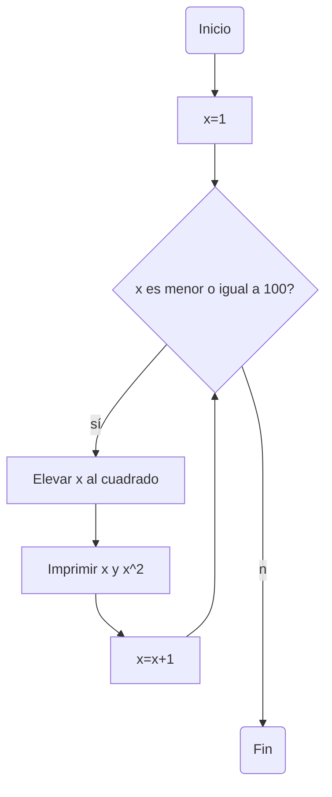
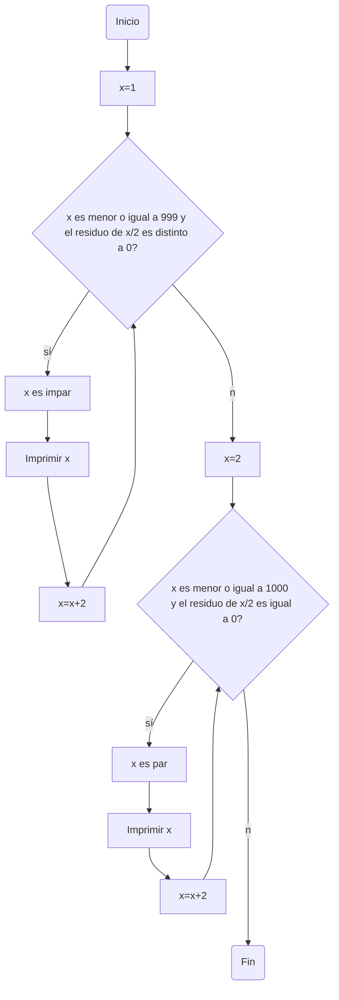
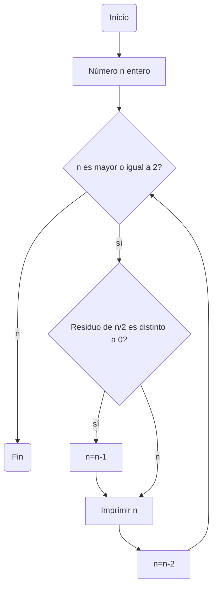

# Reto 7: bucles
**Instrucciones**

Desarrolle de manera individual la mayoría de ejercicios en clase. Para cada punto cree un programa individual asimismo cree un notebook con la solución a todos los problemas. Al finalizar suba todo a un repo y subalo al canal reto_7 en slack, los tres primeros puntos deben incluir diagrama de flujo.

## Punto uno
Imprimir un listado con los números del 1 al 100 cada uno con su respectivo cuadrado.

**Diagrama de flujo**

## Punto dos
Imprimir un listado con los números impares desde 1 hasta 999 y seguidamente otro listado con los números pares desde 2 hasta 1000.

**Diagrama de flujo**

## Punto tres
Imprimir los números pares en forma descendente hasta 2 que son menores o iguales a un número natural n ≥ 2 dado.

**Diagrama de flujo**

## Punto cuatro
En 2022 el país A tendrá una población de 25 millones de habitantes y el país B de 18.9 millones. Las tasas de crecimiento anual de la población serán de 2% y 3% respectivamente. Desarrollar un algoritmo para informar en que año la población del país B superará a la de A.
## Punto cinco
Imprimir el factorial de un número natural n dado.
## Punto seis
Implementar un algoritmo que permita adivinar un número dado de 1 a 100, preguntando en cada caso si el número es mayor, menor o igual.
## Punto siete
Implementar un programa que ingrese un número de 2 a 50 y muestre sus divisores.
## Punto ocho
Implementar el algoritmo que muestre los números primos del 1 al 100. Nota: use funciones.
